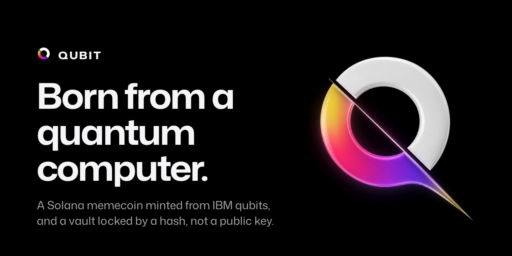
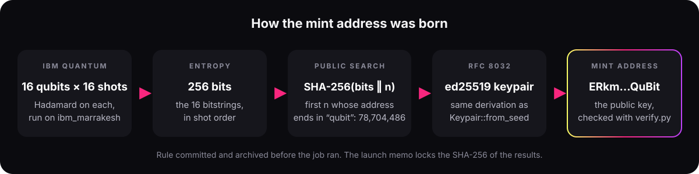
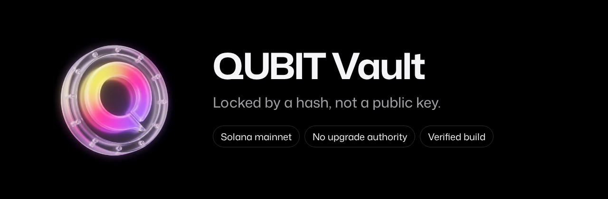
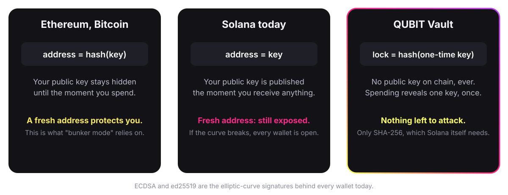
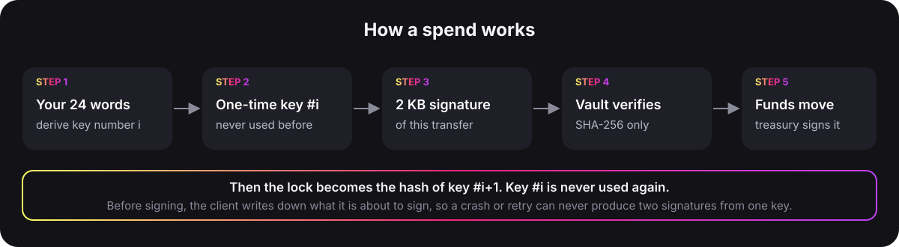

<p align="center">
  
</p>

<p align="center">
  <b>A Solana memecoin whose mint address came out of an IBM quantum computer,<br>and a vault locked by a hash, not a public key.</b><br>
  Open source, and every claim checkable with code you can read.
</p>

<p align="center">
  <a href="#launch-record">Launch record</a> ·
  <a href="#how-the-address-is-derived">How the address is derived</a> ·
  <a href="#verify">Verify</a> ·
  <a href="#qubit-vault">QUBIT Vault</a> ·
  <a href="#verify-the-deployed-vault">Verify the vault</a> ·
  <a href="#repository-layout">Layout</a>
</p>

<table align="center">
  <tr>
    <td align="center" width="25%"><br><b>Born from qubits</b><br>16 qubits, 16 shots on <code>ibm_marrakesh</code> gave the 256 bits behind the mint address.</td>
    <td align="center" width="25%"><br><b>Fixed in advance</b><br>The rule was archived before the job ran, and the launch memo locks the results hash.</td>
    <td align="center" width="25%"><br><b>QUBIT Vault</b><br>Live on Solana mainnet, with no upgrade authority and a verified build.</td>
    <td align="center" width="25%"><br><b>One key, one spend</b><br>Every withdrawal uses a fresh one-time key, then the lock moves on.</td>
  </tr>
</table>

# QUBIT

A memecoin whose mint address is derived from the output of an IBM quantum
computer. The code was published here before the quantum job ran, and anyone
can check the result with nothing but Python.

<p align="center">
  
</p>

## Launch record

| | |
|---|---|
| Mint address | `ERkmk5rs8KKD9u2fxoDZUmwwuVc7rT3sSeowGTrQuBit` |
| Counter | `78704486` |
| IBM job | `db3vkeclf4us73c206fg` on `ibm_marrakesh` |
| Measurement bits | [`proof/quantum_results.json`](proof/quantum_results.json), SHA-256 `70f278b95b555fc6b6ea2637169228b81c47fa861afa5c4f3f0938658f802668` |
| Circuit as run | [`proof/circuit.qasm`](proof/circuit.qasm) |
| Launch transaction | [`2FDFF7GD…NyV2A`](https://solscan.io/tx/2FDFF7GDTWxLSmukVBwDM4pLPVt8XKxYDk4eub3xPxjqSHqvqMMeuXp3e4cRYDr3siCULWN8uNaPf7HSVVXNyV2A) |

Timeline, 2026-10-08 UTC:

| Time | Event |
|---|---|
| 20:13:20 | Derivation rule archived at commit `5fb8834` ([snapshot](https://web.archive.org/web/20261008201426/https://github.com/humdonsolana/QUBIT/tree/5fb88345bfa1da73bc764df687c2cde1e7ff05d5)) |
| 20:16:57 | Job submitted to IBM Quantum |
| 20:17:16 | Job finished on `ibm_marrakesh` |
| 22:13:20 | Token created. The transaction's memo records the job, the counter and the SHA-256 of the results file |
| After launch | Results published in `proof/` |

## How the address is derived

1. 16 qubits, a Hadamard gate on each, measured over 16 shots on real IBM
   Quantum hardware.
2. The 16 bitstrings, in shot order, give 256 bits of entropy.
3. `seed = SHA-256(entropy || n)`, where `n` is the smallest counter whose
   address ends in `qubit`, in any letter case.
4. The seed gives an ed25519 keypair (RFC 8032, the same derivation as
   Solana's `Keypair::from_seed`). Its public key is the mint address.

The exact rule is in the docstring of [`src/verify.py`](src/verify.py).

## Verify

No installation is needed:

```bash
git clone https://github.com/humdonsolana/QUBIT && cd QUBIT
python3 src/verify.py proof/quantum_results.json ERkmk5rs8KKD9u2fxoDZUmwwuVc7rT3sSeowGTrQuBit 78704486
sha256sum proof/quantum_results.json
```

`verify.py` uses only the Python standard library, and its ed25519 code is
copied verbatim from RFC 8032. A `MATCH` proves the address comes from the
published bits. The file's SHA-256 matches the memo written in the launch
transaction, so the bits were fixed before anyone could see them. That the
bits came from IBM is shown by the job ID and a screen recording of the job.

## Run the pipeline

Requires Python 3.10 or newer and an IBM Quantum Platform API key.

```bash
pip install -r requirements.txt
export IBM_QUANTUM_TOKEN="..."
python3 src/run_quantum_job.py    # run the circuit on IBM hardware, save the bits to private/
python3 src/derive_keypair.py     # search the counter, write the mint keypair to private/
```

Tests: `python3 -m unittest discover -s tests -v`

## QUBIT Vault

<p align="center">
  
</p>

QUBIT also ships a vault for Solana whose lock is a hash, not a public key. A normal Solana address is an
ed25519 public key; if elliptic curves ever fall, to quantum computers or new mathematics, that key gives up its
private key. A QUBIT vault stores only the SHA-256 hash of its next one-time key. Spending reveals that key as a
WOTS+ signature (2,144 bytes over 67 SHA-256 chains, the parameters NIST standardized in FIPS 205); the program
checks it with SHA-256, moves the funds and locks the vault to the next key. 24 words recover everything.

<p align="center">
  
</p>

The code is in [`vault/`](vault/): the on-chain program, the `qubit` command-line tool, the signature library and
an independent Python reference.

### Deployed program

| | |
|---|---|
| Program | [`3kQoxmBhrQztTBRVhqkGbMbUcpQpK64cbadrt2y9kbjX`](https://explorer.solana.com/address/3kQoxmBhrQztTBRVhqkGbMbUcpQpK64cbadrt2y9kbjX) on Solana mainnet |
| Deploy transaction | [`2KmMjE1g…uTSx`](https://explorer.solana.com/tx/2KmMjE1g37uaYXQnih1gc3vbat3wxrTTa9T9JG27t2E9YmG5ByMwMmA4GF2RqJVzvaoPD4ooCBnimVKZLhqXuTSx), slot 454698516 |
| Upgrade authority | None: the program can never change |
| Source | [`vault/`](vault/) at commit [`a5f578b`](https://github.com/humdonsolana/QUBIT/commit/a5f578b7472b5c9a4faa1179b25bcfe461e89062) |
| Executable hash | `2119566b5b1c2c3e601b110cdbadc3f3cc01962ab567cdab69ecc8ae254efa56`, the same for the program on mainnet and a reproducible build of that commit |
| Build image | `solanafoundation/solana-verifiable-build:4.2.1` (`sha256:797c1c7882e5ee53339fbeae6e7b411f791d09647b01817b38b13ef1bb8231ff`) |
| Independent check | [OtterSec: verified](https://verify.osec.io/status/3kQoxmBhrQztTBRVhqkGbMbUcpQpK64cbadrt2y9kbjX) |
| Audit | Not audited. Hold only what you can afford to lose. |

### How a spend works

<p align="center">
  
</p>

Each key signs exactly once. The program enforces it by replacing the stored lock after every spend. The client
enforces it by writing down what it is about to sign before it signs, so a crash or a retry can never produce two
signatures from one key. If a committed transfer can never succeed, `qubit resume --recover` rotates the key without
executing it.

### Verify the deployed vault

Needs Docker and [`solana-verify`](https://github.com/Ellipsis-Labs/solana-verifiable-build)
(`cargo install solana-verify --locked`). This rebuilds `vault/` at the deployed commit inside the pinned image
and compares the result with the program on mainnet:

```bash
solana-verify verify-from-repo -u https://solana-rpc.publicnode.com \
  --program-id 3kQoxmBhrQztTBRVhqkGbMbUcpQpK64cbadrt2y9kbjX \
  https://github.com/humdonsolana/QUBIT \
  --commit-hash a5f578b7472b5c9a4faa1179b25bcfe461e89062 \
  --library-name qubit_vault --mount-path vault \
  --base-image solanafoundation/solana-verifiable-build:4.2.1
```

If it offers to upload a verification record, answer no: the record is already on chain. To build it yourself
and compare the two hashes by hand:

```bash
git clone https://github.com/humdonsolana/QUBIT && cd QUBIT && git checkout a5f578b
solana-verify build --base-image solanafoundation/solana-verifiable-build:4.2.1 --library-name qubit_vault "$PWD/vault"
solana-verify get-executable-hash vault/target/deploy/qubit_vault.so
solana-verify get-program-hash -u https://solana-rpc.publicnode.com 3kQoxmBhrQztTBRVhqkGbMbUcpQpK64cbadrt2y9kbjX
```

Both commands must print `2119566b5b1c2c3e601b110cdbadc3f3cc01962ab567cdab69ecc8ae254efa56`.

### Quick start

```bash
cd vault
cargo install --path cli
qubit keygen                                   # prints 24 words, write them down
qubit create                                   # creates the vault, prints its address
# send SOL or tokens to that address from any wallet or exchange
qubit balance
qubit send 1.5 --to <address>                  # SOL
qubit send 100 --to <address> --mint <mint>    # tokens
qubit sweep --from hot-wallet.json             # move everything from an old wallet in one go
qubit recover                                  # new machine: type the 24 words, you are back
```

Commands use mainnet unless you pass `--url devnet`. Fees come from an ordinary wallet (`--fee-payer`, default
`~/.config/solana/id.json`) that never holds vault funds. If a `send` is interrupted, `qubit resume` finishes it.
Full reference: [vault/cli/README.md](vault/cli/README.md).

### What it protects against

| Covered | Not covered |
|---|---|
| Recovery of ed25519 or ECDSA keys from public keys, at any speed | Losing the 24 words or the optional passphrase |
| A compromised fee-payer wallet (it can only pay fees) | A practical break of SHA-256 (Solana itself fails first) |
| A malicious RPC (worst case: your transaction is not forwarded) | Malware on the machine where you type the words |
| Replaying a spend on another vault, cluster or key index | |
| Front-running vault creation (the address commits to your first key) | |

The vault is cold storage. It does not plug into browser wallets or DeFi; move funds to a hot wallet when you need
to use them.

### Build and test

From `vault/` (Rust 1.85+, Solana CLI 4.2+ with `cargo build-sbf`, Python 3):

```bash
cargo fmt --all --check
cargo clippy --workspace --all-targets -- -D warnings
scripts/build-program.sh
cargo test --workspace
python3 -I tests/reference/wots_ref.py --check crates/wots/tests/vectors.json
scripts/e2e-localnet.sh
```

Dean Little's [WinterWallet](https://github.com/blueshift-gg/winterwallet) and
[solana-winternitz](https://github.com/blueshift-gg/solana-winternitz) brought Winternitz signatures to Solana
first.

## Repository layout

| Path | What it holds |
| --- | --- |
| `src/`, `tests/`, `proof/` | The mint proof: job runner, derivation, verifier and the published results |
| `vault/` | The QUBIT Vault: program, command-line tool, signature library, reference |
| `assets/` | Images used in this README |

The mint proof is MIT licensed. `vault/` is MIT or Apache-2.0, at your option.
